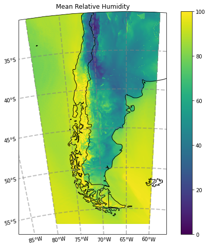

# Plotting a variable over a specified region:

Here we show the mean relative humidity field over a user-defined region.


```python
# We import the necessary libraries
import xarray as xr
import h5netcdf
import datetime
import s3fs
import cartopy.crs as ccrs
import cartopy.feature as cf
import matplotlib.pyplot as plt
import regionmask
```

We define the forecast initialization date:


```python
fcst_year = 2022
fcst_month = 3
fcst_day = 21
fcst_hour = 0
```

We define the averaging period for relative humidity:


```python
start_year = 2022
start_month = 3
start_day = 21
start_hour = 0
final_year = 2022
final_month = 3
final_day = 21
final_hour = 23
```

We define the region of interest (using lat and lon):


```python
lat_min = -60
lat_max = -30
lon_min = -80
lon_max = -60
```

Reading the forecast:


```python
FCST_DATE = datetime.datetime(start_year, start_month, start_day, start_hour)

START_DATE = datetime.datetime(start_year, start_month, start_day, start_hour)
FINAL_DATE = datetime.datetime(final_year, final_month, final_day, final_hour)

# We calculate the lead time
start_leadtime = int((START_DATE - FCST_DATE).total_seconds()/3600)
final_leadtime = int((FINAL_DATE - FCST_DATE).total_seconds()/3600)

fs = s3fs.S3FileSystem(anon=True)

files = [f'smn-ar-wrf/DATA/WRF/DET/{FCST_DATE:%Y/%m/%d/%H}/WRFDETAR_01H_{FCST_DATE:%Y%m%d_%H}_{leadtime:03d}.nc' for leadtime in range(start_leadtime, final_leadtime)]
ds_list = []
for s3_file in files:
    print(s3_file)
    if fs.exists(s3_file):
        f = fs.open(s3_file)
        ds_tmp = xr.open_dataset(f, decode_coords = 'all', engine = 'h5netcdf')
        ds_list.append(ds_tmp)
    else:
        print('The file {} does not exist'.format(s3_file))

ds = xr.combine_by_coords(ds_list, combine_attrs = 'drop_conflicts')
```

We select the data of the chose subdomain and we compute the mean value: 


```python
corners = [[lon_min, lat_min], [lon_min, lat_max], [lon_max, lat_max], [lon_max, lat_min]]

# We build the mask defining the region  
region = regionmask.Regions([corners])
mask = region.mask(ds['lon'], ds['lat'])

# We select the variable HR2 and compute the daily mean at each gridpoint
HR = ds[['HR2']]
HR_mean = HR.mean(dim = 'time')

# We eliminate the values outside the mask 
HR_region = HR_mean.where(mask == 0, drop = True)
```


```python
# We chose a map projection
proyection = ccrs.LambertConformal(central_longitude = ds.CEN_LON, 
                                   central_latitude = ds.CEN_LAT, 
                                   standard_parallels = (ds.TRUELAT1, 
                                                         ds.TRUELAT2))

fig = plt.figure(figsize = (10, 8)), 
ax = plt.axes(projection = proyection)
cbar = ax.pcolormesh(HR_region['lon'], HR_region['lat'], HR_region['HR2'], transform = ccrs.PlateCarree(), vmin = 0, vmax = 100)
ax.add_feature(cf.COASTLINE) # add coastlines
ax.add_feature(cf.BORDERS) # add country borders
ax.set_title(f'Mean Relative Humidity')

gl = ax.gridlines(crs = ccrs.PlateCarree(), draw_labels = True, x_inline = False,
                  linewidth = 2, color = 'gray', alpha = 0.5, linestyle = '--')
gl.top_labels = False
gl.right_labels = False
plt.colorbar(cbar)
```



Para descargar la notebook acceder al siguiente [link](../notebooks/Region.ipynb).

